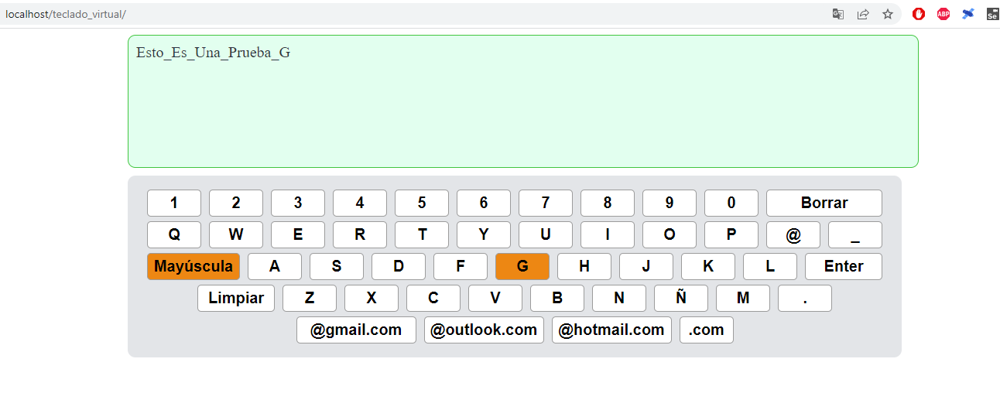

<h1 align="center">Teclado Virtual</h1>

  

<h3 align="center">
Este código es un teclado virtual pensado para incorporar en diferentes implementaciones. El teclado tiene varias filas que incluyen letras, números y carácteres especiales, 2 teclas especiales, "CapsLock" y "BackSpace", que cambian la capitalización de las letras y borran caracteres, respectivamente y teclas de ingreso directo de casillas de email.
</h3>
